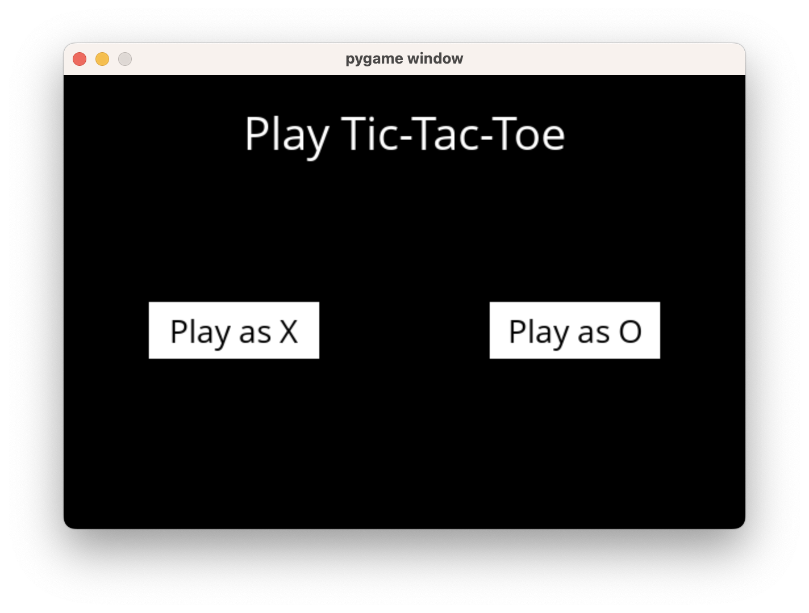
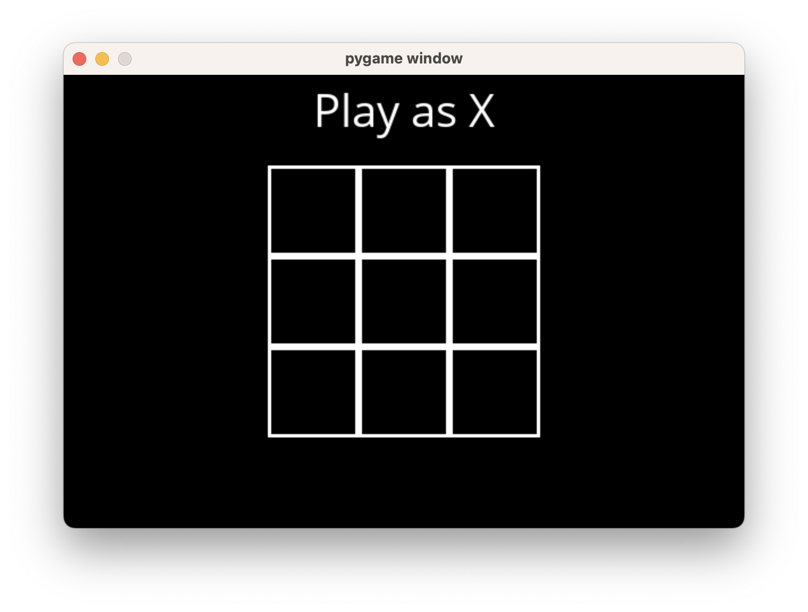
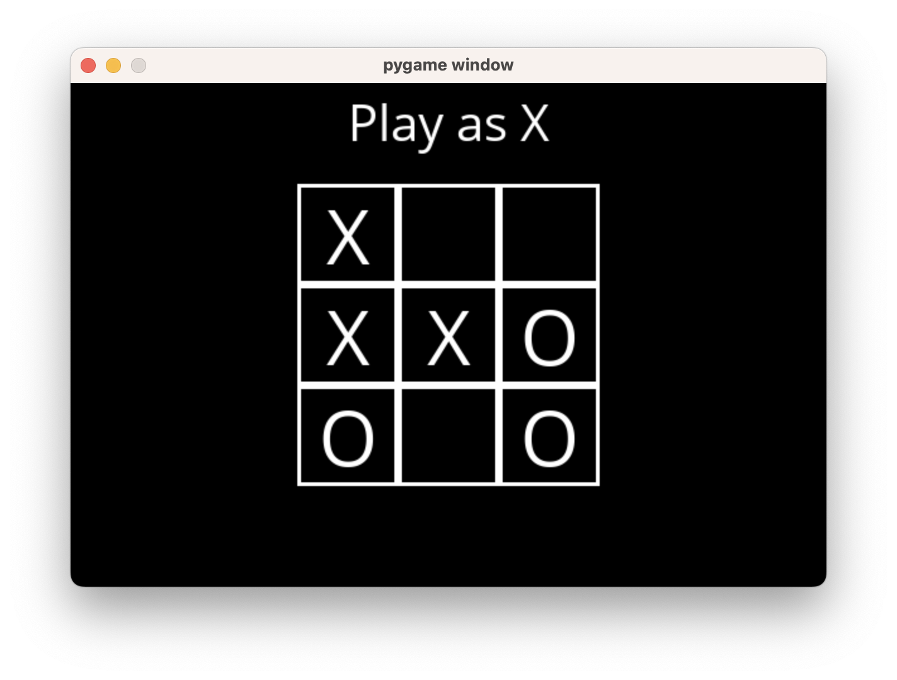
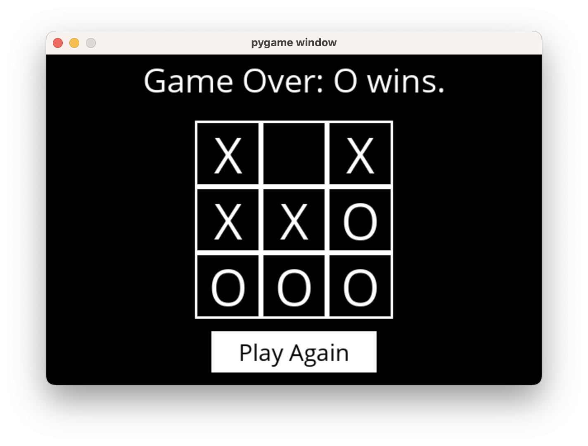

# AI Tic-Tac-Toe

A Tic-Tac-Toe game that uses artificial intelligence. User can play against the computer.

Uses MinMax algorithm along with Alpha-Beta Pruning.

Please download required dependencies from requirements.txt.

1. Start screen

2. Game starts

3. During the game

4. Game over
